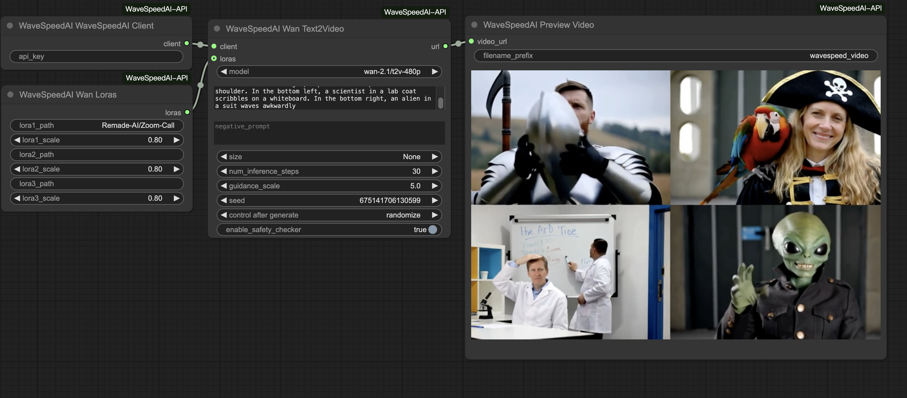
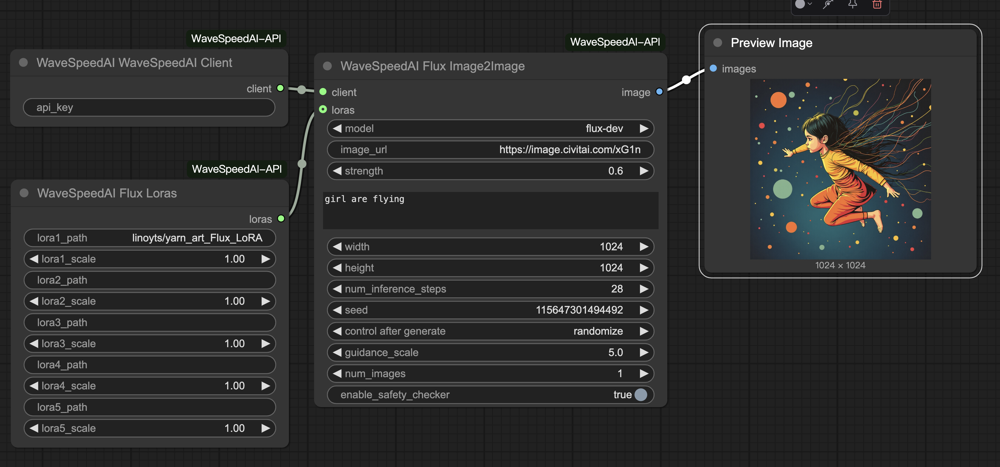
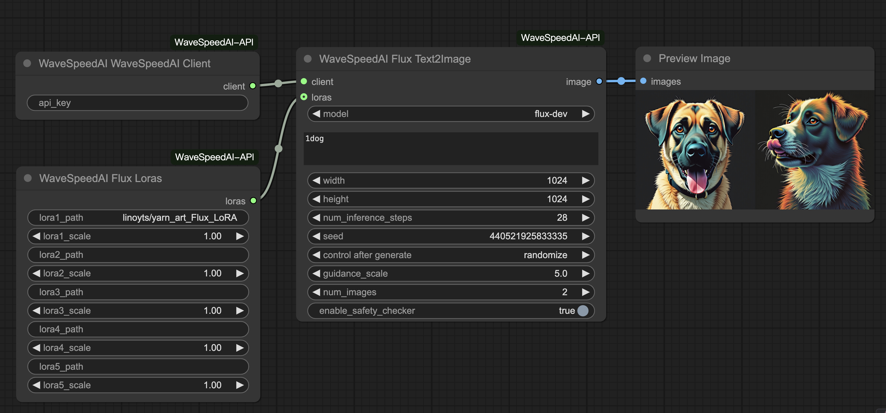

# ComfyUI-WaveSpeedAI-API

This is a custom node for ComfyUI that allows you to use the WaveSpeed AI API directly in ComfyUI. WaveSpeed AI is a high-performance AI image and video generation service platform offering industry-leading generation speeds. For more information, see [WaveSpeed AI Documentation](https://wavespeed.ai/docs).

## Requirements
Before using this node, you need to have a WaveSpeed AI API key. You can obtain your API key from the [WaveSpeed AI](https://wavespeed.ai).

## Installation

### Installing manually

1. Navigate to the `ComfyUI/custom_nodes` directory.

2. Clone this repository: `git clone https://github.com/WaveSpeedAI/wavespeed-comfyui.git`
  
3. Install the dependencies:
  - Windows (ComfyUI portable): `python -m pip install -r requirements.txt`
  - Linux or MacOS: `pip install -r requirements.txt`
4. If you don't want to expose your API key in the node, you can rename the `config.ini.tmp` file to `config.ini` and add your API key there.

5. Start ComfyUI and enjoy using the WaveSpeed AI API node!

## Nodes

### Client

This node is used to create a WaveSpeed AI client.

### Wan Text to Video (T2V)

This node generates a video from a text prompt using the Wan2.1 T2V model.

  

Example workflow: [wan-t2v-lora.json](./examples/wan-t2v-lora.json)

Sample output: [wavespeed_video_1743346194.mp4](./examples/wavespeed_video_1743346194.mp4)

### Flux Image to Image (I2I)

This node generates images from input images using the Flux Dev model with LoRA support.

  

Example workflow: [flux-dev-lora-i2i.json](./examples/flux-dev-lora-i2i.json)

### Flux Text to Image (T2I)

This node generates images from text prompts using the Flux Dev model with LoRA support.

  

### Preview Video

This node is used to preview and save videos generated by the WaveSpeed AI API.
