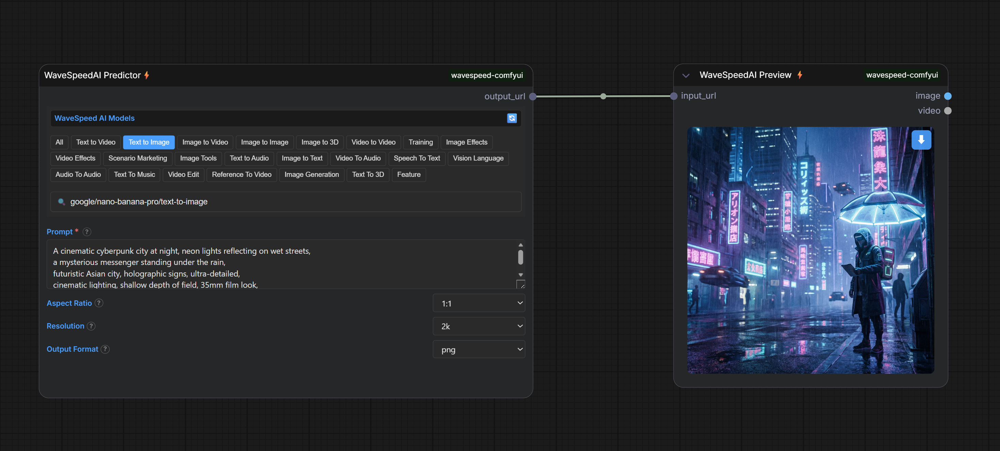
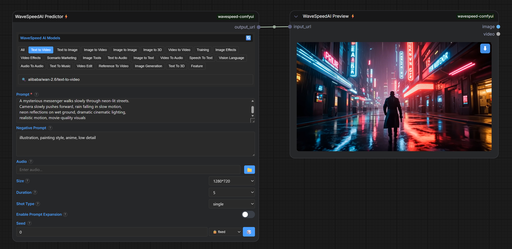
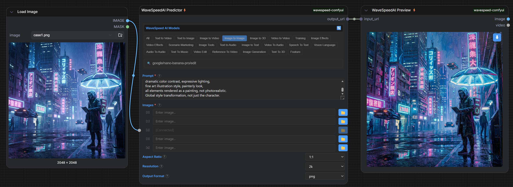
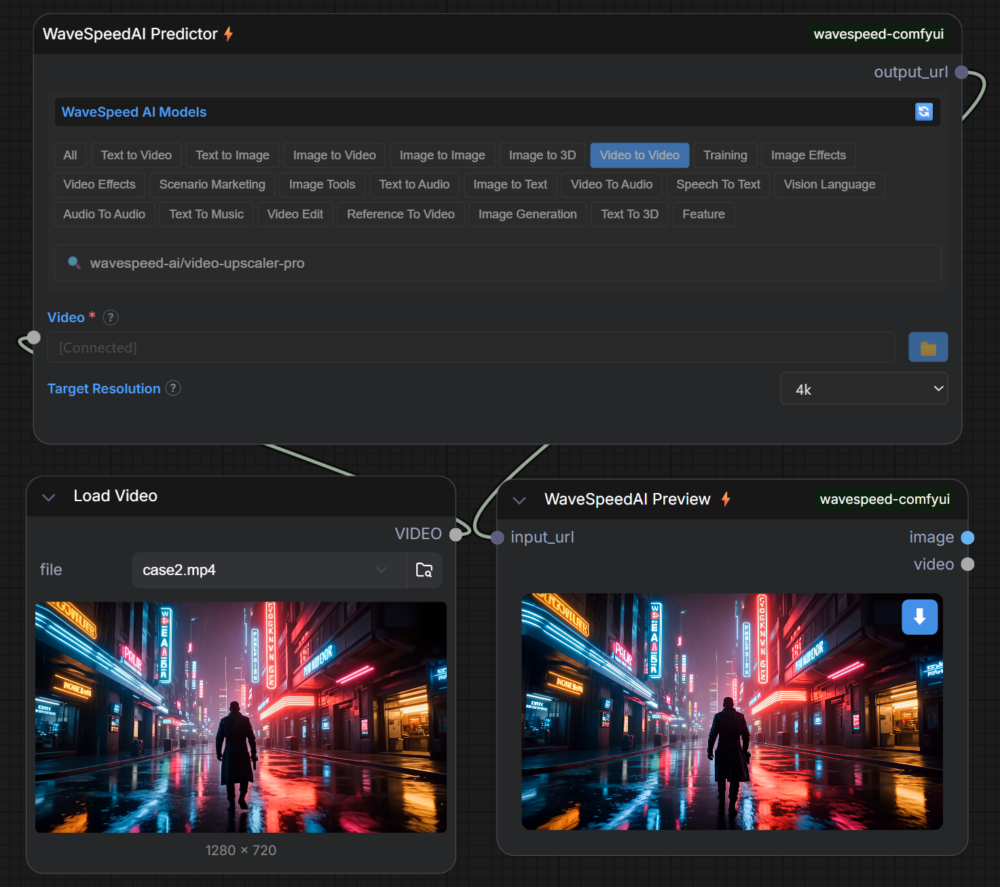
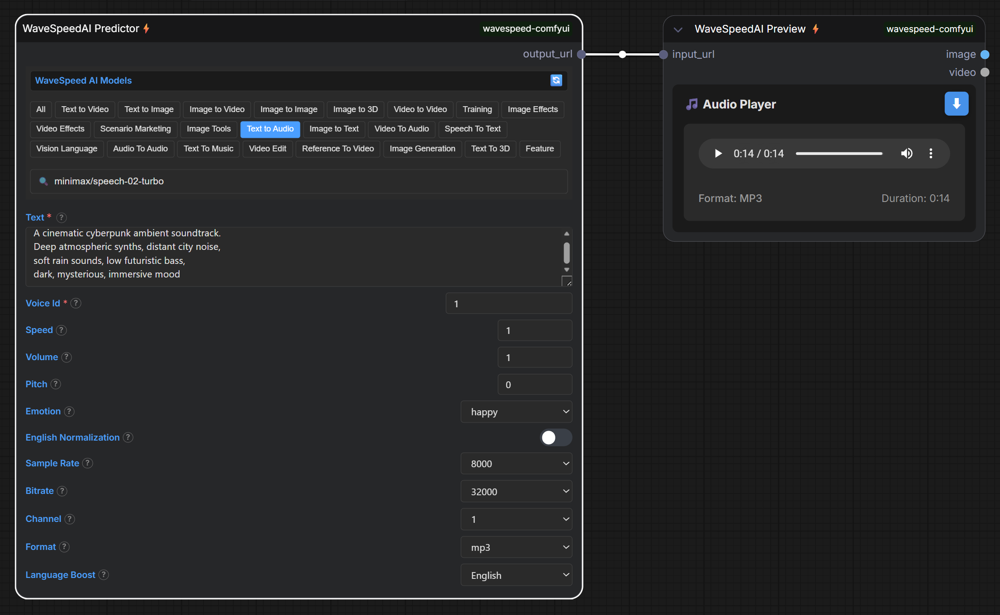
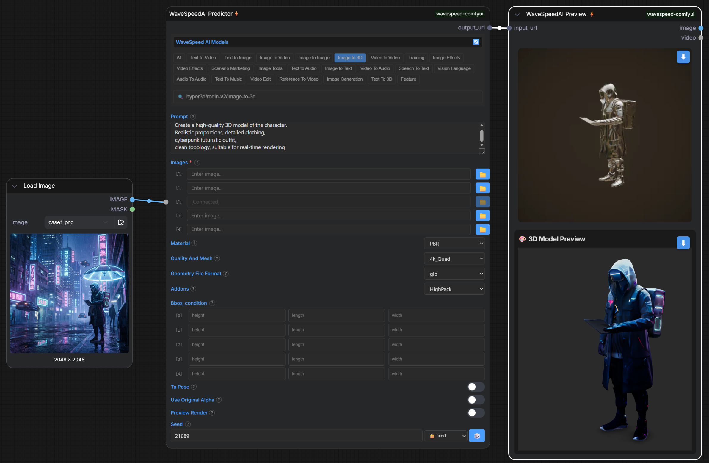
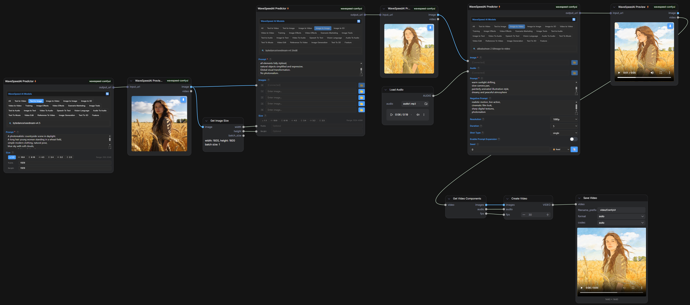

# 🚀 ComfyUI-WaveSpeed: Universal AI Generation Plugin

<div align="center">

[](LICENSE)
[](https://github.com/comfyanonymous/ComfyUI)
[](https://wavespeed.ai)

**One Plugin, All Modalities** | Text→Image | Image→Image | Text→Video | Video→Video | Text→Audio | Image→3D

</div>

---

## ✨ Features

### 🎭 Multi-Modal Generation
Support for **20+ AI generation categories** including:
- **Text to Image** - Generate images from text prompts
- **Image to Image** - Transform and edit existing images
- **Text to Video** - Create videos from text descriptions
- **Video to Video** - Transform and enhance videos
- **Text to Audio** - Generate audio from text
- **Image to 3D** - Convert images to 3D models
- And more...

### 🎯 Unified Interface
- **Single Predictor Node** - Access 600+ AI models through one node
- **Dynamic Parameters** - Model-specific parameters auto-configure
- **Fuzzy Search** - Quickly find models by name or category
- **Category Tabs** - Browse models by type

### ⚡ Performance & UX
- **Smart Caching** - Fast model loading after first use (first load: 5-10 seconds)
- **Progress Indicators** - Real-time generation progress
- **Workflow Support** - Save and restore complete workflows
- **Connection Flexibility** - Connect any compatible input/output

---

## 📦 Installation

### Prerequisites
- [ComfyUI](https://github.com/comfyanonymous/ComfyUI) installed
- [WaveSpeed AI API Key](https://wavespeed.ai) (free tier available)

### Installation Steps

```bash
cd ComfyUI/custom_nodes
git clone https://github.com/WaveSpeedAI/wavespeed-comfyui.git
cd wavespeed-comfyui
pip install -r requirements.txt
```

Restart ComfyUI after installation.

### Configuration
1. Get your API key from [WaveSpeed AI](https://wavespeed.ai)
2. In ComfyUI: `Settings` → `WaveSpeed` → Enter API Key
3. Or create `config.json` in plugin directory:
```json
{
  "api_key": "your_api_key_here"
}
```

> ⏱️ **First Load Notice**: The first time you add a WaveSpeed node, it may take more than 5 seconds to fetch the model list from the API. Subsequent loads will be much faster.

---

## 🎨 Usage Examples

### Example 1: Text-to-Image Generation

📸 **High-Quality Image Generation**



**Use Case:** Generate professional-quality images from text descriptions

**Models:** Flux Dev, SDXL, Ghibli Style, etc.

**Key Features:**
- Multiple aspect ratios (1:1, 16:9, 9:16, etc.)
- Resolution control (512px - 2048px)
- Seed control for reproducibility
- Negative prompts support

**Result:**


[📥 Download Workflow JSON](examples/case1-text-to-image/case1-t2i.json)

---

### Example 2: Text-to-Video Generation

🎬 **Create Videos from Text**



**Use Case:** Generate short videos from text prompts

**Models:** Kling v1.6, Minimax Video, Wan2.1, etc.

**Key Features:**
- Duration control (2-10 seconds)
- Resolution options (480p, 720p, 1080p)
- Camera movement control
- Audio generation option

**Note:** Video generation may take several minutes. The plugin supports up to 30-minute timeout for long-running tasks.

**Result:**

https://github.com/user-attachments/assets/c6f5383b-2b80-4166-b9ea-dcfe406884b6

[📥 Download Workflow JSON](examples/case2-text-to-video/case2-t2v.json)

---

### Example 3: Image-to-Image Transformation

🎨 **Transform and Edit Images**



**Use Case:** Transform existing images with AI

**Models:** Flux Redux, Instant Character, Step1X Edit, etc.

**Key Features:**
- Style transfer
- Image editing with prompts
- Reference image support
- Strength control

**Result:**


[📥 Download Workflow JSON](examples/case3-image-to-image/case3-i2i.json)

---

### Example 4: Image-to-Video Animation

🎬 **Animate Static Images**

**Use Case:** Bring static images to life with motion

**Models:** Stable Video Diffusion, I2VGen-XL, etc.

**Key Features:**
- Motion generation from single image
- Camera movement control
- Duration control
- Smooth animation

**Result:**

📹 **[Download Video](examples/case4-image-to-video/case4.mp4)** | [📥 Download Workflow JSON](examples/case4-image-to-video/case4-i2v.json)

---

### Example 5: Video-to-Video Enhancement

🎞️ **Enhance and Transform Videos**



**Use Case:** Upscale, stylize, or transform videos

**Models:** Seedance v1.5, Real-ESRGAN, etc.

**Key Features:**
- Video upscaling (2x, 4x)
- Style transformation
- Motion preservation
- Frame interpolation

**Result:**

📹 **[Download Video](examples/case5-video-to-video/case5.mp4)** | [📥 Download Workflow JSON](examples/case5-video-to-video/case5-v2v.json)

---

### Example 6: Text-to-Audio Generation

🎵 **Generate Audio from Text**



**Use Case:** Generate music, sound effects, or voice from text

**Models:** Dia TTS, MMAudio V2, etc.

**Key Features:**
- Voice synthesis
- Music generation
- Sound effect creation
- Multiple voice options

**Result:**

[case6.mp3](https://github.com/user-attachments/files/24638715/case6.mp3)

[📥 Download Workflow JSON](examples/case6-text-to-audio/case6-t2a.json)

---

### Example 7: Image-to-3D Model

🎲 **Convert Images to 3D**



**Use Case:** Generate 3D models from 2D images

**Models:** Hunyuan 3D V2, etc.

**Key Features:**
- Multi-view generation
- GLB format export
- Texture mapping
- Mesh optimization

**Result:**

[📦 Download 3D Model (.glb)](examples/case7-image-to-3d/case7.glb) | [📥 Download Workflow JSON](examples/case7-image-to-3d/case7-i23D.json)

---

### Example 8: Complex Multi-Stage Pipeline

🔗 **Advanced ComfyUI Integration**



**Use Case:** Demonstrate seamless integration with ComfyUI native nodes and complex multi-stage pipelines

**Workflow Highlights:**
- **Multiple WaveSpeed Nodes** - Chain multiple AI generation steps (T2I → I2I → I2V)
- **Native Node Integration** - Mix with ComfyUI's Load Image, Save Image, Preview Image nodes
- **Flexible Data Flow** - Pass IMAGE/VIDEO tensors between nodes seamlessly
- **Real-world Pipeline** - Text→Image → Image Enhancement → Image→Video

**Pipeline Stages:**

1. **Stage 1: Text-to-Image (WaveSpeed Predictor #1)**
   - Generate base image from text prompt
   - Model: Text-to-Image model (e.g., FLUX)
   - Output: ComfyUI IMAGE tensor
   - **Native Integration**: Output connects directly to ComfyUI Preview Image node

2. **Stage 2: Image-to-Image Enhancement (WaveSpeed Predictor #2)**
   - Enhance and refine the generated image
   - Model: Image-to-Image model (e.g., Flux Redux)
   - Input: IMAGE tensor from Stage 1 (via native ComfyUI connection)
   - Output: Enhanced IMAGE tensor
   - **Native Integration**: Seamlessly receives IMAGE from previous WaveSpeed node

3. **Stage 3: Image-to-Video Animation (WaveSpeed Predictor #3)**
   - Animate the enhanced image into video
   - Model: Image-to-Video model (e.g., Stable Video Diffusion)
   - Input: Enhanced IMAGE tensor from Stage 2
   - Output: VIDEO URL
   - **Native Integration**: Works with ComfyUI's video preview nodes

4. **Stage 4: Preview & Save (Native ComfyUI Nodes)**
   - Use ComfyUI's Preview Image nodes to view intermediate results
   - Use Save Image nodes to export final outputs
   - All connections work exactly like native ComfyUI nodes

**Key Integration Features:**

✅ **Tensor Compatibility**
   - WaveSpeed nodes accept ComfyUI IMAGE/VIDEO/AUDIO tensors directly
   - No manual conversion needed - just connect and run
   - Works with any image/video processing node in ComfyUI ecosystem

✅ **Output Flexibility**
   - Outputs can connect to any compatible node
   - Support for Preview Image, Save Image, Video Preview, etc.
   - Chain multiple WaveSpeed nodes together seamlessly

✅ **Workflow Persistence**
   - All connections saved in workflow JSON
   - Model selections preserved across sessions
   - Parameter values restored on load
   - Full workflow portability

✅ **Native ComfyUI Features**
   - Works with node groups and reroute nodes
   - Compatible with workflow templates
   - Supports ComfyUI's execution queue
   - Full undo/redo support
   - Drag-and-drop connections

**Results:**

**Stage 1 & 2 Outputs (Text-to-Image → Image-to-Image):**

<table>
  <tr>
    <td align="center">
      <br>
      <em>Stage 1: Generated Image</em>
    </td>
    <td align="center">
      <br>
      <em>Stage 2: Enhanced Image</em>
    </td>
  </tr>
</table>

**Stage 3 Output (Image-to-Video):**

https://github.com/user-attachments/assets/10949f10-4010-4eed-a38e-159ec83dede0

[📥 Download Workflow JSON](examples/case8-complex-pipeline/case8-combination.json)

---

## 🔧 Core Nodes

### WaveSpeedAI Predictor ⚡

**Input:**
- **Dynamic parameters** - Auto-generated based on selected model
  - Common parameters: `prompt`, `negative_prompt`, `seed`, `resolution`, etc.
  - Media inputs: `image`, `video`, `audio` (accepts ComfyUI IMAGE/VIDEO/AUDIO tensors or URLs)
  - All parameters can be set via UI widgets or connected from other nodes

**Output:**
- `output` (ANY) - URL string or list of URLs:
  - Single output → URL string (e.g., `"https://cdn.wavespeed.ai/image.png"`)
  - Multiple outputs → List of URLs (e.g., `["url1", "url2"]`)
  - 3D model tasks → List containing preview images + 3D model URL

**Note:** Output is URL format, not tensor. Use WaveSpeedAI Preview node to convert to IMAGE/VIDEO tensors for further processing.

---

### WaveSpeedAI Preview 👁️

**Input:**
- `input_url` (ANY) - Accepts URL string, list of URLs, or text content from WaveSpeed Predictor

**Output:**
- `image` (IMAGE) - ComfyUI IMAGE tensor (if input is image URL)
- `video` (VIDEO) - ComfyUI VIDEO tensor (if input is video URL)

**Note:** Automatically detects input type and converts URLs to tensors. For 3D model tasks, only displays preview without tensor conversion.

---

## 📚 Advanced Features

### Dynamic Parameter System

The plugin automatically generates input fields based on each model's schema. Parameters can be:
- Set via UI widgets (text fields, dropdowns, sliders)
- Connected from other nodes (images, videos, audio, numbers, text)
- Mixed (UI defaults + node connections)

### Array Parameters

For models that accept multiple inputs (e.g., multiple reference images):

**Example: Multiple Reference Images**
```
image_0 → First reference
image_1 → Second reference
image_2 → Third reference
```

The plugin automatically:
- Expands array parameters to individual inputs
- Limits to API-defined maxItems (typically 5)
- Merges back to array format for API submission

### Size Parameter Handling

The plugin intelligently handles size parameters:

**Enum Size (Dropdown):**
- Models like Seedance provide fixed size options
- Example: "auto", "1024*1024", "1024*1536"
- UI shows dropdown selector

**Range Size (Width/Height):**
- Models like Flux allow custom dimensions
- UI shows separate width/height inputs
- Ratio buttons for quick selection (1:1, 16:9, 9:16, etc.)
- Each component can be connected independently

### Tensor Upload

When you connect image/video/audio nodes, the plugin automatically:
1. Detects the data type (image/video/audio)
2. Converts to appropriate format (PNG/MP4/WAV)
3. Uploads to WaveSpeed CDN
4. Passes the URL to the API

**Supported input types:**
- ComfyUI IMAGE tensors
- ComfyUI VIDEO tensors
- ComfyUI AUDIO dicts
- VHS_AUDIO callables
- VideoFromFile objects

### Smart Output Detection

The plugin intelligently detects output types and returns the appropriate format:
- **Images**: URL or tensor (for further processing)
- **Videos**: URL (for preview or download)
- **Audio**: URL (for playback)
- **3D Models**: URL with .glb/.obj format (for 3D viewer)
- **Text**: Plain text output

### Workflow Save/Restore

**Automatic Workflow Persistence:**
- All node states saved in workflow JSON
- Model selections preserved
- Parameter values restored
- Input connections maintained

---

## ❓ FAQ

<details>
<summary><b>Q: How do I get an API key?</b></summary>

Visit [WaveSpeed AI](https://wavespeed.ai) and sign up. Free tier includes:
- 100 credits per month
- Access to all models
- No credit card required
</details>

<details>
<summary><b>Q: Why is the first load slow?</b></summary>

The first load fetches the complete model list from WaveSpeed API (5-10 seconds). Subsequent loads use cached data and are much faster.
</details>

<details>
<summary><b>Q: Why can't I find a specific model?</b></summary>

1. Check if you're in the correct category tab
2. Use the fuzzy search feature
3. Model might be temporarily unavailable
4. Check WaveSpeed AI dashboard for model status
</details>

<details>
<summary><b>Q: How do I handle "Task timed out" errors?</b></summary>

The default timeout is 30 minutes. For longer tasks:
1. Check your network connection
2. Try a different model
3. Reduce output resolution/duration
4. Contact support if issue persists
</details>

<details>
<summary><b>Q: Can I use local LoRA files?</b></summary>

No, but you can:
1. Upload LoRA to Hugging Face
2. Use the public URL in the plugin
3. Or use WaveSpeed's built-in LoRA library
</details>

---

## 🛠️ Troubleshooting

### Common Issues

**Issue: "No API key configured"**
- Solution: Configure your API key using Settings → WaveSpeed
- Verify key at [WaveSpeed Dashboard](https://wavespeed.ai/dashboard)

**Issue: "Model list not loading"**
- Solution: Check your internet connection and API key validity
- First load may take 5-10 seconds
- Check ComfyUI console for error messages

**Issue: "Task timeout"**
- Solution: Video generation can take up to 30 minutes
- Check network connection
- Try reducing output resolution/duration

**Issue: "Upload failed"**
- Solution: Check file size limits and format compatibility
- Ensure your API key has sufficient credits

**Issue: "VideoFromFile is not JSON serializable"**
- Solution: Update to latest version (v2.0+)
- This issue has been fixed in the new architecture

**Issue: "Cannot find WaveSpeed nodes"**
- Restart ComfyUI completely
- Check `custom_nodes/wavespeed-comfyui` exists
- Check console for error messages

---

## 🤝 Contributing

We welcome contributions! Here's how you can help:

### Report Issues
- Use GitHub Issues
- Include workflow JSON
- Provide error messages
- Describe expected vs actual behavior

### Submit Pull Requests
1. Fork the repository
2. Create a feature branch
3. Make your changes
4. Add tests if applicable
5. Submit PR with clear description

### Improve Documentation
- Fix typos
- Add examples
- Translate to other languages
- Create video tutorials

---

## 📄 License

This project is licensed under the MIT License - see the [LICENSE](LICENSE) file for details.


---

## 📞 Support

Need help? We're here for you:

- 🌐 **Official Website**: [wavespeed.ai](https://wavespeed.ai) - Live chat support available
- 💬 **Discord**: [Join our community](https://discord.gg/wavespeed)
- 📖 **Documentation**: [WaveSpeed Docs](https://wavespeed.ai/docs)
- 🐛 **Bug Reports**: [GitHub Issues](https://github.com/WaveSpeedAI/wavespeed-comfyui/issues)

Our support team is ready to assist you with any questions or issues.

---

## 📊 Changelog

### v2.0.0
- Complete architecture redesign with unified Predictor node
- Support for 20+ model categories and 600+ models
- Dynamic parameter generation from model schemas
- Fuzzy search and category filtering
- Smart output detection and format conversion
- Automatic tensor upload and conversion
- Real-time progress tracking
- Support for long-running tasks (30-minute timeout)
- VideoFromFile support for video-to-video models
- Size component widget for resolution parameters
- Workflow save/restore functionality
- Array parameter expansion (images, loras, etc.)
- Object array support (bbox_condition, etc.)

---

<div align="center">

**Made with ❤️ by the WaveSpeed Team**

[⭐ Star us on GitHub](https://github.com/WaveSpeedAI/wavespeed-comfyui) | [🌐 Visit WaveSpeed.ai](https://wavespeed.ai)

</div>
